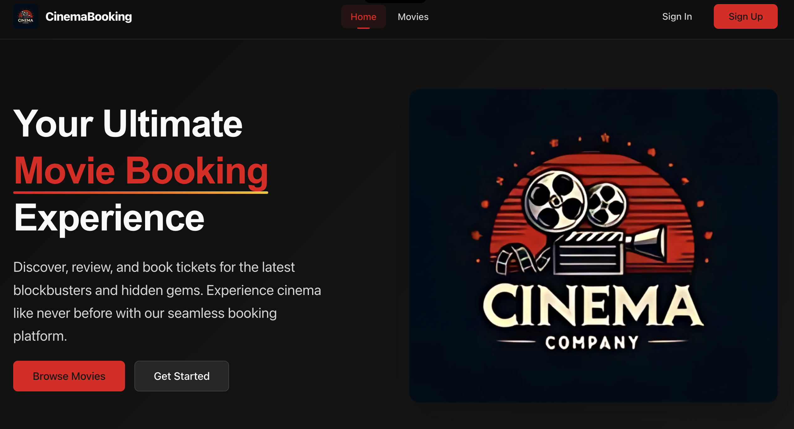
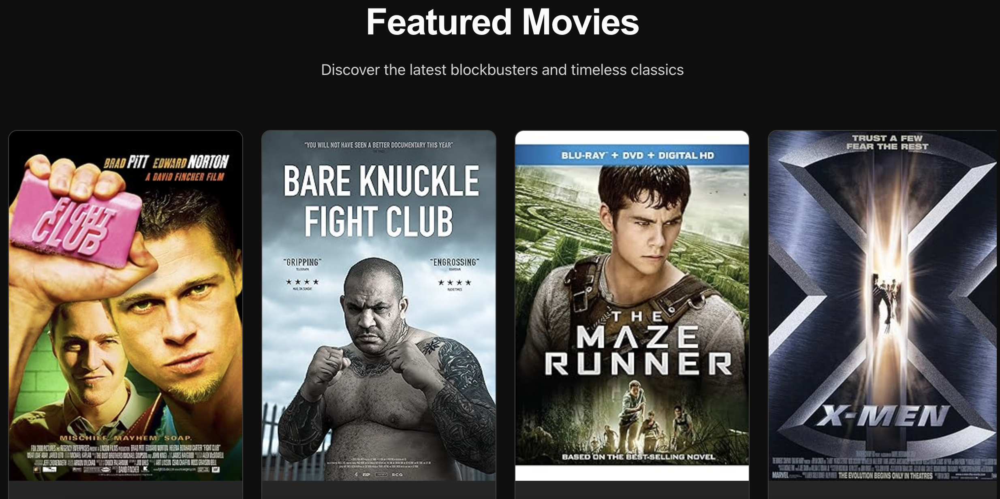
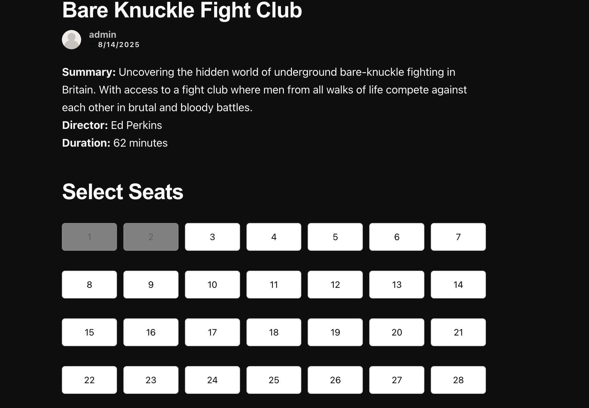
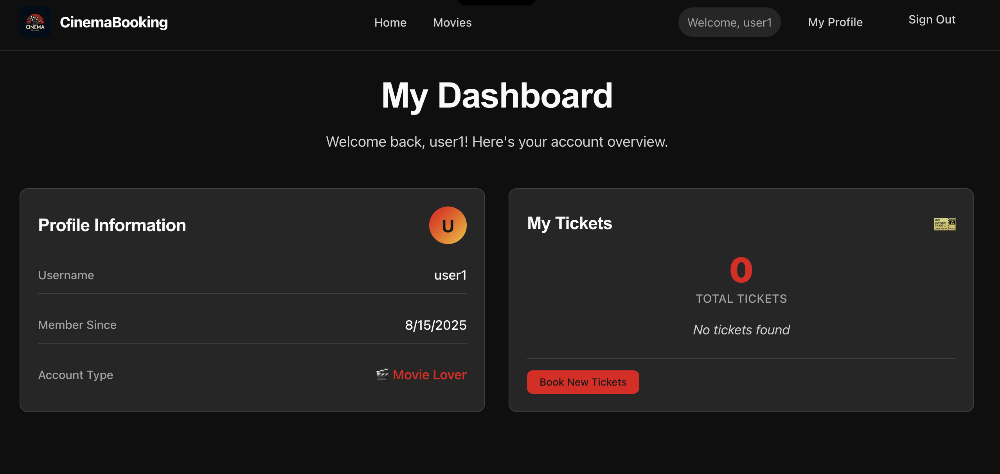
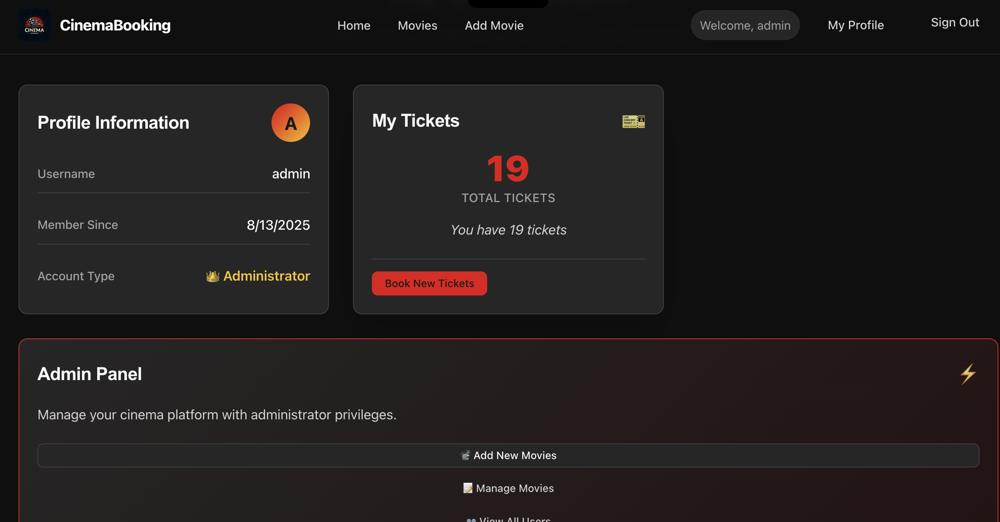

# 🎬 MovieHero - Cinema Booking System Frontend

[](https://final-commit-group-mern-stack-front-ctl9e7kiw.vercel.app/)
[](https://reactjs.org/)
[](https://vitejs.dev/)
[](https://github.com/css-modules/css-modules)

> **Your Ultimate Movie Booking Experience** 🍿  
> A premium, cinematic React application for discovering, reviewing, and booking tickets for the latest blockbusters. Experience cinema like never before with our sleek, responsive interface.

## 📖 Table of Contents

- [✨ Features](#-features)
- [🛠 Tech Stack](#-tech-stack)
- [🚀 Quick Start](#-quick-start)
- [🎨 Design System](#-design-system)
- [🏗 Project Structure](#-project-structure)
- [📱 Screenshots](#-screenshots)
- [🌐 Live Demo](#-live-demo)

## ✨ Features

### 🎯 Core Functionality
- **🎬 Movie Discovery**: Browse movies with beautiful poster displays and horizontal scrolling
- **🎫 Smart Seat Booking**: Interactive seat selection with real-time availability
- **👤 User Authentication**: Secure sign-up/sign-in with form validation and error handling
- **⭐ Review System**: Rate and review movies with star ratings and comments
- **📊 User Dashboard**: Personal ticket history and profile management
- **👑 Admin Panel**: Administrative controls for movie and user management

### 🎨 Design Features
- **🌙 Dark Cinematic Theme**: Premium cinema-inspired design with red accents
- **📱 Fully Responsive**: Mobile-first design that works on all devices
- **🎪 CSS Modules**: Component-scoped styling for maintainable code
- **🎭 Design Tokens**: Consistent color palette and typography system
- **♿ Accessibility**: WCAG AA compliant with proper ARIA attributes
- **🚀 Smooth Animations**: Hover effects, transitions, and loading states

### 🔧 Technical Features
- **⚡ Lightning Fast**: Vite-powered development and build process
- **🔄 Real-time Updates**: Optimistic UI updates with backend sync
- **🛡️ Error Handling**: Graceful error boundaries and user feedback
- **🔍 OMDb Integration**: Search and add movies from external API
- **🗂️ State Management**: Efficient React state with hooks
- **🧩 Component Architecture**: Reusable, modular components

## 🛠 Tech Stack

### Frontend Framework
```
⚛️ React 19           - UI framework with latest features
⚡ Vite               - Next-generation build tool
🧭 React Router DOM   - Client-side routing
🎯 React Hooks        - State and lifecycle management
```

### Styling & Design
```
🎨 CSS Modules        - Component-scoped styling
🎭 CSS Variables      - Design token system
📱 Media Queries      - Responsive design
🎪 Flexbox/Grid       - Modern layout systems
♿ ARIA Attributes     - Accessibility support
```

### Development Tools
```
📦 npm               - Package manager
🔧 ESLint            - Code linting
🚀 Vercel            - Deployment platform
🌐 Fetch API         - HTTP requests
🔑 JWT Handling      - Authentication tokens
```

## 🚀 Quick Start

### Prerequisites
- Node.js (v18+ recommended)
- npm or yarn
- Access to MovieHero Backend API

### Installation

1. **Clone the repository**
   ```bash
   git clone https://github.com/AM-973/moviehero_FE.git
   cd moviehero_FE
   ```

2. **Install dependencies**
   ```bash
   npm install
   ```

3. **Environment setup**
   ```bash
   # Create .env file
   touch .env
   ```
   
   Add the following variables:
   ```env
   VITE_BACK_END_SERVER_URL=https://moviehero-4965967c38ad.herokuapp.com
   VITE_OMDB_API_KEY=your_omdb_api_key
   ```

4. **Start the development server**
   ```bash
   npm run dev
   ```

5. **Build for production**
   ```bash
   npm run build
   ```

🎉 **Application running at** `http://localhost:5173`

## 🎨 Design System

### 🎭 Color Palette
```css
/* Cinema Theme Colors */
--color-primary: #dc2626;      /* Cinema Red */
--color-secondary: #f59e0b;    /* Gold Accent */
--color-background: #0f0f0f;   /* Deep Black */
--color-surface: #1a1a1a;      /* Dark Surface */
--color-text: #f5f5f5;         /* Light Text */
```

### 📏 Typography Scale
```css
/* Font Sizes */
--font-size-xs: 0.75rem;       /* 12px */
--font-size-sm: 0.875rem;      /* 14px */
--font-size-base: 1rem;        /* 16px */
--font-size-lg: 1.125rem;      /* 18px */
--font-size-xl: 1.25rem;       /* 20px */
--font-size-2xl: 1.5rem;       /* 24px */
--font-size-3xl: 1.875rem;     /* 30px */
--font-size-4xl: 2.25rem;      /* 36px */
```

### 🎪 Component Library
- **Cards**: Movie cards with hover effects and poster displays
- **Buttons**: Primary, secondary, and ghost button variants
- **Forms**: Styled inputs, textareas, and validation states
- **Navigation**: Fixed header with responsive menu
- **Modals**: Loading states and error messages
- **Icons**: SVG icon system with consistent sizing

## 🏗 Project Structure

```
moviehero-frontend/
├── 📁 public/                  # Static assets
│   └── 🖼️ vite.svg            # Favicon
├── 📁 src/                     # Source code
│   ├── 📁 assets/              # Images and static files
│   │   └── 📁 images/          # SVG icons and logos
│   ├── 📁 components/          # Reusable components
│   │   ├── 🎬 MovieList/       # Movie grid display
│   │   ├── 🎭 MovieDetails/    # Single movie view
│   │   ├── 📝 MovieForm/       # Add/edit movies
│   │   ├── ⭐ ReviewForm/      # Review creation
│   │   ├── 🧭 NavBar/          # Navigation header
│   │   ├── 🔐 SignIn/          # Authentication
│   │   ├── 📊 Dashboard/       # User dashboard
│   │   └── 🎪 Landing/         # Homepage
│   ├── 📁 pages/               # Page components
│   │   └── 🔍 AddMovie/        # OMDb search page
│   ├── 📁 services/            # API services
│   │   ├── 🔐 authService.js   # Authentication API
│   │   ├── 🎬 movieService.js  # Movie operations
│   │   └── 👤 userService.js   # User operations
│   ├── 📁 styles/              # Global styles
│   │   ├── 🎭 tokens.css       # Design tokens
│   │   └── 🌐 global.css       # Global styles
│   ├── ⚛️ App.jsx              # Main application
│   ├── 🚀 main.jsx             # Application entry
│   └── 🎨 index.css            # Base styles
├── 📦 package.json             # Dependencies
├── ⚡ vite.config.js           # Vite configuration
└── 📝 README.md                # Project documentation
```

## 📱 Screenshots

### 🏠 Homepage
Beautiful landing page with hero section and feature highlights


### 🎬 Movie Gallery
Horizontal scrolling movie cards with poster displays


### 🎭 Movie Details
Comprehensive movie information with seat booking interface


### 📊 User Dashboard
Personal ticket history and profile management


### 👑 Admin Panel
Administrative controls for content management

## 🌐 Live Demo

### Application Links
🎬 **Live Application**: [https://final-commit-group-mern-stack-front-ctl9e7kiw.vercel.app/](https://final-commit-group-mern-stack-front-ctl9e7kiw.vercel.app/)  
🔗 **Backend API**: [https://moviehero-4965967c38ad.herokuapp.com](https://moviehero-4965967c38ad.herokuapp.com)


---

<div align="center">

### 🎬 Built with ❤️ by Movie Lovers for Movie Lovers

**[🎬 Frontend Repo](https://github.com/AM-973/moviehero_FE)** • **[⭐ Backend Repo](https://github.com/am-973/moviehero_be)** • **[🌟 Star this repo](https://github.com/AM-973/moviehero_FE)** 

Made by The Final Commit | © 2025 MovieHero  

</div>

